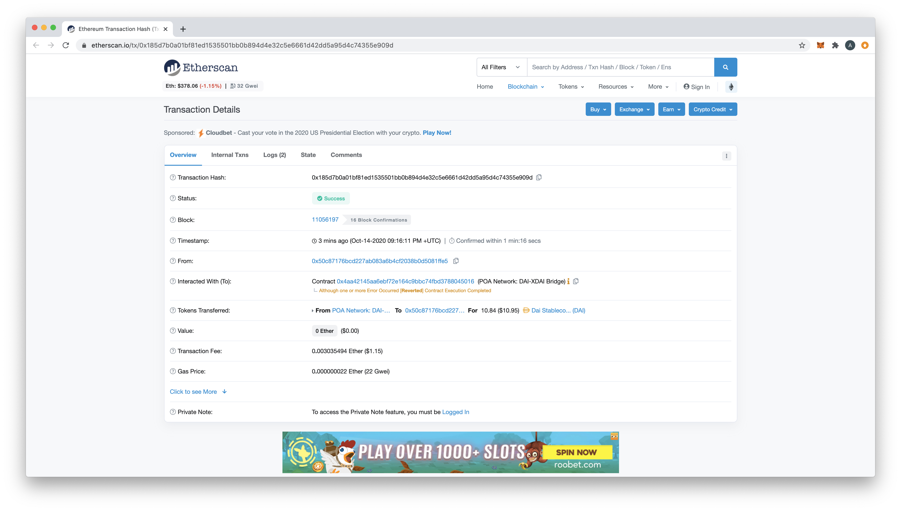

# Alternative receiver for the xDai bridge

The new feature _Alternative Receiver_ has integrated in the contracts of the xDai bridge as part of [the recent contracts upgrade](https://forum.poa.network/t/migration-of-the-xdai-tokenbridge-completed/3212). With this feature it becomes possible to transfer tokens through the bridge to any account by very simple actions. It means that Alice can send Dai to Bob’s account on the xDai chain in one transaction, and Bob can send xDai to Clare’s account on the Ethereum Mainnet in one transaction too.

Due to different nature of tokens on two sides of the xDai bridge the operations to transfer assets to an alternative receiver from one chain to another differ as well.

## Dai to xDai

1. Open MetaMask and choose the Ethereum Mainnet.

2. Go to the Dai Token Contract -&gt; Write Contract functionality in Etherscan.  
[https://etherscan.io/address/0x6b175474e89094c44da98b954eedeac495271d0f\#writeContract](https://etherscan.io/address/0x6b175474e89094c44da98b954eedeac495271d0f#writeContract)

3. Connect to your Web3Wallet \(MetaMask\).


4. Approve the bridge contract to perform operations with tokens:

* `usr(address)` -- the address of the xDai bridge contract in the Ethereum Mainnet: `0x4aa42145Aa6Ebf72e164C9bBC74fbD3788045016`
* `wad(uint256)` -- the amount of tokens \(in Wei\) approved to send through the bridge \(in this case 2 Dai\): `2000000000000000000`
* Click **Write**


4. Confirm the transaction in the MetaMask and wait until it is included in the chain.


5. Initialize the xDai bridge contract interface in Etherscan. Here you will write to the proxy contract. [https://etherscan.io/address/0x4aa42145aa6ebf72e164c9bbc74fbd3788045016\#writeProxyContract](https://etherscan.io/address/0x4aa42145aa6ebf72e164c9bbc74fbd3788045016#writeProxyContract)

6. You will see several  `relayTokens` methods. Use Method \(1\) to send to an alternate address. You can also use a second method \(14\) if the Dai deposit is performed by another contract of behalf of the user account \(like a DEX\). There are also 2 other relayToken methods \(4\), \(22\) that specify a `_token(address)`. These are not in use.

**relayTokens Method \(1\)**

* `_receiver (address)` - address of the alternate receiver, the account that will be sent native tokens on the xDai chain
* `_amount (uint256)` - the amount of tokens \(in Wei\) to transfer; must be less or equal amount of tokens approved for the bridge operations
* Click **Write**

**relayTokens Method\(14\)**

* `_sender (address)` - optional. Use when the Dai deposit is performed by another contract on behalf of a user account \(e.g. by a DEX\)
* `_receiver (address)` - address of the alternate receiver, the account that will be sent native tokens on the xDai chain
* `_amount (uint256)` - the amount of tokens \(in Wei\) to transfer; must be less or equal amount of tokens approved for the bridge operations
* Click **Write**


7. Submit the transaction in the MetaMask and wait until it is included in the chain.

8. The xDai bridge will take some time to relay the deposit request to the xDai chain. Once complete, the balance of the `_receiver`account will increase with the corresponding amount of xDai.

### xDai to Dai


Since Etherscan does not currently support xDai, we use MyEtherWallet for this example. You can also use Nifty Wallet or BlockScout.


1. Choose the xDai chain in the browser wallet extension and login to [MyEtherWallet \(MEW\)](https://www.myetherwallet.com/access-my-wallet). 

2. Initialize the xDai bridge contract interface by putting the bridge contract address `0x7301CFA0e1756B71869E93d4e4Dca5c7d0eb0AA6` and the following JSON in the **`ABI/JSON Interface`** field:

```javascript
[{"type":"function","stateMutability":"payable","payable":true,
"outputs":[],"name":"relayTokens","inputs":[{"type":"address",
"name":"_receiver"}],"constant":false}]
```


3. Prepare the call for the  `relayTokens` method:


where

* `_receiver` -- Account to receive Dai tokens on the Ethereum Mainnet
* `Value in ETH` -- the amount of native tokens \(in ether\) to transfer

4. Submit the transaction in the MetaMask and wait when it is included in the chain. Copy the transaction hash of the confirmation  
  
5.  Visit the helper contract: [https://blockscout.com/poa/xdai/address/0x6A92e97A568f5F58590E8b1f56484e6268CdDC51/read-contract](https://blockscout.com/poa/xdai/address/0x6A92e97A568f5F58590E8b1f56484e6268CdDC51/read-contract)  
  
6. In the `getMessageHash` method field add the following information from your originating transaction and press the Query button. The method will return a hashed message.

*  DAI recipient \(alternate address funds were sent to\)
* Value \(in **Wei** - do not include fees, only amount sent \(Wei converter at [http://eth-converter.com/](http://eth-converter.com/)\)
* Originating transaction hash

6\) Copy the message hash and paste into the `getMessage` method. If you receive 0x0 it means either the bridge oracles did not send a confirmation for the withdrawal yet or the data entered in the step 3 is incorrect. Double check the info and if it is correct you will eventually receive the message.

7\) Once you receive the message, use the message hash again this time with the `getSignatures` method. It will return a blob with packed signatures provided by the validator. The method could fail if not enough signatures are collected.


8\) Go to Etherscan on mainnet and connect a web3 wallet: [https://etherscan.io/address/0x4aa42145aa6ebf72e164c9bbc74fbd3788045016\#writeProxyContract](https://etherscan.io/address/0x4aa42145aa6ebf72e164c9bbc74fbd3788045016#writeProxyContract)

9\) Enter the message \(from `getMessage` method above\) and the signatures blob to the  `executeSignatures` method, press the **Write** button and complete the transaction with a Web3 wallet. If the method reverts, the withdrawal was likely already executed. You can check all input for the recipient here: [https://etherscan.io/token/0x6b175474e89094c44da98b954eedeac495271d0f?a=0x](https://etherscan.io/token/0x6b175474e89094c44da98b954eedeac495271d0f?a=0x)..., where the recipient's address follows after “a=“.


Once you have written to the contract method, a View your **transaction** button will appear. Click to view the pending transaction. 




